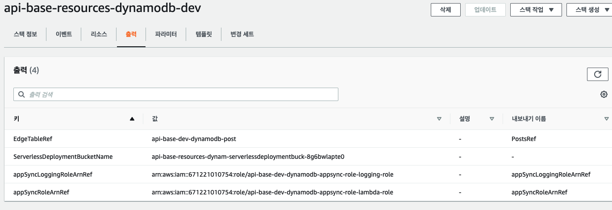

# 클라우드 포메이션이란 무엇일까요?

AWS CloudFormation은 AWS 리소스를 모델링하고 설정하여 리소스 관리 시간을 줄이고  
AWS에서 실행되는 애플리케이션에 더 많은 시간을 사용하도록 햊는 서비스입니다.  
AWS 리소스에 대해서 설명하는 템플릿을 생성하면 AWS CloudFormation이 해당 리소스의  
프로비져닝과 구성을 담당합니다.

## AWS CloudFormation 개념

AWS CloudForamtion을 사용하는 경우에 템플릿 및 스택으로 작업합니다.  
템플릿을 생성하여 AWS 리소스와 해당 속성에 대해 설명하는 것이죠  
스택을 생성 할 때 마다 AWS CloudFormation에서 템플릿에 설명된 리소스를 프로비져닝 합니다.  

## 템플릿

AWS CloudFormation 템플릿은 JSON 또는 YAML 형식의 텍스트 파일입니다.  
AWS CloudFormation에서는 템플릿을 AWS 리소스 구축을 위한 블루 프린트로 사용합니다.

다음 예제 템플릿을 사용하여 스택을 생성하면,   
ami-0ff8a91507f77f867 AMI ID, t2.micro 인스턴스 유형,  
testkey 키 페어 이름 및 Amazon EBS 볼륨을 사용하여 인스턴스를 프로비저닝합니다.

### 예시 JSON

```json
{
  "AWSTemplateFormatVersion" : "2010-09-09",
  "Description" : "A sample template",
  "Resources" : {
    "MyEC2Instance" : {
      "Type" : "AWS::EC2::Instance",
      "Properties" : {
        "ImageId" : "ami-0ff8a91507f77f867",
        "InstanceType" : "t2.micro",
        "KeyName" : "testkey",
        "BlockDeviceMappings" : [
          {
            "DeviceName" : "/dev/sdm",
            "Ebs" : {
              "VolumeType" : "io1",
              "Iops" : "200",
              "DeleteOnTermination" : "false",
              "VolumeSize" : "20"
            }
          }
        ]
      }
    }
  }
}
```

### 예시 YAML

```yml
AWSTemplateFormatVersion: "2010-09-09"
Description: A sample template
Resources:
  MyEC2Instance:
    Type: "AWS::EC2::Instance"
    Properties: 
      ImageId: "ami-0ff8a91507f77f867"
      InstanceType: t2.micro
      KeyName: testkey
      BlockDeviceMappings:
        -
          DeviceName: /dev/sdm
          Ebs:
            VolumeType: io1
            Iops: 200
            DeleteOnTermination: false
            VolumeSize: 20
```

단일 템플릿에서 여러 리소스를 지정하고 해당 리소스를 함께 작동하도록 구성할 수도 있습니다.   
예를 들어, 다음 예제와 같이 탄력적 IP(EIP)를 포함하도록 이전 템플릿을 수정한 후 Amazon EC2 인스턴스와 연결할 수 있습니다.

```json
{
  "AWSTemplateFormatVersion" : "2010-09-09",
  "Description" : "A sample template",
  "Resources" : {
    "MyEC2Instance" : {
      "Type" : "AWS::EC2::Instance",
      "Properties" : {
        "ImageId" : "ami-0ff8a91507f77f867",
        "InstanceType" : "t2.micro",
        "KeyName" : "testkey",
        "BlockDeviceMappings" : [
          {
            "DeviceName" : "/dev/sdm",
            "Ebs" : {
              "VolumeType" : "io1",
              "Iops" : "200",
              "DeleteOnTermination" : "false",
              "VolumeSize" : "20"
            }
          }
        ]
      }
    },
    "MyEIP" : {
      "Type" : "AWS::EC2::EIP",
      "Properties" : {
        "InstanceId" : {"Ref": "MyEC2Instance"}
      }
    }
  }
}
```

- 위를 보면 `"Ref"` 가 보이는데. `"MyEC2Instance"` 로 정의된 논리적 이름을 참조한다는 이야기입니다.
- 보통 저렇게 논리적인 이름을 `"Ref"` 하게 되면 해당 ARN을 참조하게 됩니다.
- ARN은 Amazaon Resource Name 의 줄임말로. 리소스를 유일하게 구분하는 Id 입니다 !!

### 예시 YAML

```yml
AWSTemplateFormatVersion: "2010-09-09"
Description: A sample template
Resources:
  MyEC2Instance:
    Type: "AWS::EC2::Instance"
    Properties: 
      ImageId: "ami-0ff8a91507f77f867"
      InstanceType: t2.micro
      KeyName: testkey
      BlockDeviceMappings:
        -
          DeviceName: /dev/sdm
          Ebs:
            VolumeType: io1
            Iops: 200
            DeleteOnTermination: false
            VolumeSize: 20
  MyEIP:
    Type: AWS::EC2::EIP
    Properties:
      InstanceId: !Ref MyEC2Instance
```

- 여기서 중요한 점이 있는데 스택을 생성할 때 값이 지정되는 입력 파라미터를 추가 가능하다.
- 스택을 생성할 때 인스턴스 유형과 같은 값을 지정 할 수 있으니 템플릿을 더 쉽게 재사용 가능함

- 추가적으로 Output 을 명시하면 스택에서 출력값을 정의하고, 다른 템플릿에서 이를 참조하는 것이 가능합니다!



## 스택

AWS CloudFormation을 사용 할 경우 스택이라는 하나의 단위로 관련 리소스를 관리합니다.  
스택을 생성, 업데이트, 삭제하여 리소스 모음을 생성, 업데이트 및 삭제 합니다.  
스택의 모든 리소스는 스택의 AWS CloudFormation 템플릿으로 정의합니다.  
콘솔, API 또는 AWS CLI를 사용하여 스택을 작업 할 수 있습니다.


## 템플릿의 기본 사항 (중요 !!)

### Resources

Resources 객체에는 리소스 객체 목록이 포함됩니다. 리소스 선언에는 리소스의 속성이 포함되는데,  
이러한 속성은 자식 객체로 자체 선언됩니다.  
어렵게 생각하지 말고. 리소스에는 Type 속성이 지정되어야 하고 특수한 형식으로 되어있다 !

`AWS::ProductIdentifier::ResourceType` 

이런 느낌인데 예시를 하나 들어주도록 하겠다.

`AWS::S3::Bucket` AWS의, S3라는 ProductID에, 리소스 타입은 Bucket인것
`AWS::Dynamodb::Table` <- 안봐도 알겠지??

- 중요한점 ! 이런 리소스들 밑에 `Properties` 속성을 두어야 하는 경우가 있다.
    - 보통은 대부분이 선택적 인자 & 디폴트 값이 정해져 있다.
    - 이런 디폴트값을 바꿔주기 위해서 사용한다.
    - EC2 배포의 경우 ImageId 같은건 필수 속성이라 필요하구.
    
```json
{
    "Resources" : {
        "HelloBucket" : {
            "Type" : "AWS::S3::Bucket",
            "Properties" : {
               "AccessControl" : "PublicRead"               
            }
        }
    }
}
```

- 버킷의 속성중 AccessControl 영역이 있다. 이를 "PublicRead" 로 바꿔준 것 !

- 또한 속성 밑에 하위속성이 또 있을 수 있으니 항상 문서를 잘 보고 코딩하자 !

```json
{
    "Resources" : {
        "HelloBucket" : {
            "Type" : "AWS::S3::Bucket",
            "Properties" : {
               "AccessControl" : "PublicRead",
               "WebsiteConfiguration" : {
                    "IndexDocument" : "index.html",
                    "ErrorDocument" : "error.html"            
               }               
            }
        }
    }
}
```

- 웹 호스팅을 할 경우 저런 Configuration 이 가능함.

https://docs.aws.amazon.com/ko_kr/AWSCloudFormation/latest/UserGuide/gettingstarted.templatebasics.html

여기 진행중. 내일 또 하기 !